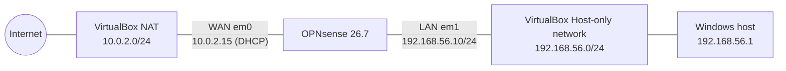

# Stage 1: OPNsense Installation and Initial Configuration

**Lab:** Network configuration with OPNsense
**Stage:** 1 of N (installation, interface assignment, web GUI access)
**Status:** ✅ Completed
**OPNsense version:** 26.7 (amd64)

---

## 1. Objective

Install OPNsense as a virtual firewall/router in VirtualBox, correctly map its WAN and LAN interfaces, assign a static LAN address reachable from the host laptop, and complete the initial setup wizard through the web GUI.

By the end of this stage, the firewall is running, the host can reach the web interface at `https://192.168.56.10`, and the WAN side receives an address from VirtualBox's NAT.

---

## 2. Environment

| Component | Details |
|---|---|
| Host | Lenovo Legion laptop, Windows 11, Japanese (JIS) keyboard |
| Hypervisor | Oracle VirtualBox |
| Guest OS | OPNsense 26.7, `OPNsense-26.7-dvd-amd64.iso` |
| Download source | opnsense.org, image type `dvd`, mirror: ROKFOSS PROJECT (Korea) |

### VM specification

| Setting | Value | Notes |
|---|---|---|
| OS type | BSD / FreeBSD (64-bit) | |
| RAM | 4096 MB+ during install, 2048 MB after | Installer requires ≥ 3000 MB to copy the live system to disk |
| CPUs | 2 | |
| Disk | 16 GB (VDI, dynamically allocated) | |
| EFI | Disabled | |
| Adapter 1 | NAT | Becomes **WAN** (`em0`) |
| Adapter 2 | Host-only Adapter | Becomes **LAN** (`em1`) |

---

## 3. Topology



The host laptop sits on the LAN side of the firewall through VirtualBox's host-only network. This mirrors a home router: one interface faces the provider (WAN), the other faces internal devices (LAN).

---

## 4. IP Addressing Plan

| Interface | Device name | MAC address | Addressing | IP |
|---|---|---|---|---|
| WAN | `em0` | `08:00:27:e8:46:f2` | DHCP from VirtualBox NAT | `10.0.2.15/24` |
| LAN | `em1` | `08:00:27:38:69:d1` | Static | `192.168.56.10/24` |
| Host (Windows) | Host-only adapter | n/a | Assigned by VirtualBox | `192.168.56.1/24` |

**Why these addresses:** VirtualBox's host-only network uses `192.168.56.0/24` by default, with the host at `.1`. Its built-in DHCP server hands out addresses from `.101` upward, so `.10` was chosen as a static address that avoids both the host and the DHCP pool. `/24` (mask `255.255.255.0`) means the first three octets identify the network and the last octet identifies the device, giving 254 usable host addresses.

---

## 5. Installation Procedure

| Step | Action |
|---|---|
| 1 | Download the `dvd` image, extract `.iso.bz2` with 7-Zip, optionally verify SHA256 with `Get-FileHash` |
| 2 | Create VM (BSD / FreeBSD 64-bit), attach ISO, configure two network adapters (NAT + Host-only) |
| 3 | Boot, log in as `installer` / `opnsense` |
| 4 | Keymap: Japanese 106 (to match the JIS keyboard) |
| 5 | Install (UFS) → target disk `ada0` (16 GB VirtualBox disk), confirm wipe |
| 6 | Set root password, choose **Halt**, eject ISO from VM storage settings |
| 7 | Boot from disk, log in as `root` |

UFS was chosen over ZFS because it is simpler and lighter on RAM, which suits a single-disk lab VM.

---

## 6. Console Configuration

### 6.1 Interface assignment (menu option 1)

The installer initially assigned the interfaces the wrong way round (LAN on `em0`, WAN on `em1`). They were reassigned manually:

```
Configure LAGGs now?          n
Configure VLANs now?          n
WAN interface name:           em0
LAN interface name:           em1
Optional interface 1:         (Enter)
Proceed?                      y
```

### 6.2 LAN IP address (menu option 2)

```
Interface:                    1 (LAN)
Configure IPv4 via DHCP?      n
New LAN IPv4 address:         192.168.56.10
Subnet bit count:             24
Upstream gateway:             (Enter, none for LAN)
IPv6 via WAN tracking/DHCP6:  n
Enable DHCP server on LAN?    n
Change GUI to HTTP?           n
```

---

## 7. Setup Wizard (Web GUI)

Accessed at `https://192.168.56.10` and logged in as `root`.

| Page | Setting | Value | Reason |
|---|---|---|---|
| General | Hostname / Domain | `OPNsense` / `internal` | |
| General | Timezone | Asia/Tokyo | Accurate timestamps in firewall logs |
| General | DNS servers | Empty | Uses DNS learned from WAN DHCP |
| General | Unbound resolver | Enabled | OPNsense acts as DNS server for LAN |
| WAN | Type | DHCP | VirtualBox NAT provides the address |
| WAN | Block RFC1918 private networks | **Disabled** | The WAN upstream is itself a private network (`10.0.2.0/24`); lab-only exception |
| WAN | Block bogon networks | Enabled | Bogon ranges should never appear as legitimate sources |
| LAN | IP address | `192.168.56.10/24` | Unchanged, keeps GUI access |
| LAN | DHCP server | Disabled | VirtualBox host-only network already runs a DHCP server; two would conflict |
| Deployment | Multi-WAN / DHCP-DNS registration / IPsec | All disabled | Not needed at this stage |

---

## 8. Troubleshooting Log

### Issue 1: Installer RAM warning
**Symptom:** UFS installer reported only 2047 MB RAM and required at least 3000 MB.
**Cause:** The installer copies the live system from memory to disk.
**Fix:** Powered off the VM and raised RAM above 4 GB for installation. RAM can be lowered to 2048 MB afterwards.

### Issue 2: VM kept booting back into the installer
**Symptom:** After "Complete Install" and reboot, the installer started again.
**Cause:** The ISO was still attached, and the boot order checks the optical drive before the hard disk.
**Fix:** Chose **Halt** instead of Reboot, then removed the ISO attachment under *Settings → Storage*.

### Issue 3: Host key unusable on JIS keyboard
**Symptom:** Mouse was captured by the VM with no way to release it; pressing Ctrl sent control characters (`^Z^C^B^N`) into the console.
**Cause:** VirtualBox's default Host key is Right Ctrl, which this Lenovo Legion JIS keyboard does not have.
**Fix:** Used `Ctrl+Alt+Del → Esc` to release the mouse, then changed the Host key to **Left Alt** under *File → Preferences → Input → Virtual Machine*. Side effect: Alt+letter combinations now trigger VirtualBox shortcuts (e.g. Alt+C toggles scale mode).

### Issue 4: WAN and LAN interfaces swapped
**Symptom:** Console showed `LAN (em0) → 192.168.1.1` and `WAN (em1) → 192.168.56.102`.
**Cause:** The installer's automatic assignment did not match VirtualBox's adapter order (Adapter 1 = `em0`, Adapter 2 = `em1`). The WAN receiving a `192.168.56.x` DHCP lease confirmed that `em1` was attached to the host-only network.
**Fix:** Reassigned interfaces with console option 1 (WAN = `em0`, LAN = `em1`). MAC addresses can be cross-checked against *VM Settings → Network → Adapter → Advanced*.

### Issue 5: Host could not reach the LAN IP
**Symptom:** `ping 192.168.56.10` from Windows timed out, and `arp -a` on the host showed no entry for `192.168.56.10`, even though the console showed the correct LAN IP.

**Diagnosis:**

| Test | Result | Conclusion |
|---|---|---|
| `ipconfig` on host | Host-only adapter = `192.168.56.1/24` | Host side correctly addressed |
| `arp -a` on host | No entry for `.10` | No layer 2 resolution from host side |
| `ping -c 3 192.168.56.1` from OPNsense shell | 3/3 replies | Virtual link works (firewall → host) |
| `ping 192.168.56.10` from host (retest) | 4/4 replies | Connectivity restored |

**Resolution:** Connectivity worked after OPNsense initiated traffic towards the host. A `pfctl -d` test (temporarily disabling the packet filter) was prepared as the next diagnostic step.
**Root cause:** Not fully confirmed. To verify in Stage 2 by re-enabling pf (`pfctl -e`) and reviewing *Firewall → Rules → LAN*.

---

## 9. Security Notes

The web GUI uses a self-signed certificate, so browsers show `ERR_CERT_AUTHORITY_INVALID`. The certificate can be verified by comparing its SHA-256 fingerprint in the browser against the fingerprint printed on the OPNsense console.

The default root password (`opnsense`) is acceptable only because this VM is reachable solely from the host-only network. It must be changed on any real deployment (*System → Access → Users*).

Disabling "Block RFC1918 private networks" on WAN is a lab-specific exception. On a production firewall facing an ISP, it should remain enabled.

Any `pfctl -d` used for testing must be reversed with `pfctl -e`.

---

## 10. Key Concepts Learned

A router connects at least two networks, so the VM needs two adapters: one for WAN (outside) and one for LAN (inside). Interface naming (`em0`, `em1`) follows the hypervisor's adapter order, and verifying the mapping via MAC addresses is a standard first step on real hardware too.

Two devices can communicate directly only when they share the same network, which is why the LAN IP had to be in `192.168.56.0/24` to match the host. Private address ranges (RFC1918: `10.0.0.0/8`, `172.16.0.0/12`, `192.168.0.0/16`) are reserved for internal networks and are not routed on the public internet.

Troubleshooting was done layer by layer: addressing (`ipconfig`), layer 2 reachability (`arp -a`), bidirectional ICMP tests, then firewall state (`pfctl`).

---

## 11. Next Steps (Stage 2)

Confirm pf is enabled and review the default LAN rules (anti-lockout rule, default allow LAN to any). Take a VirtualBox snapshot of this working state. Check for firmware updates to confirm WAN internet access. Then add a client VM on the LAN side and write custom firewall rules.
