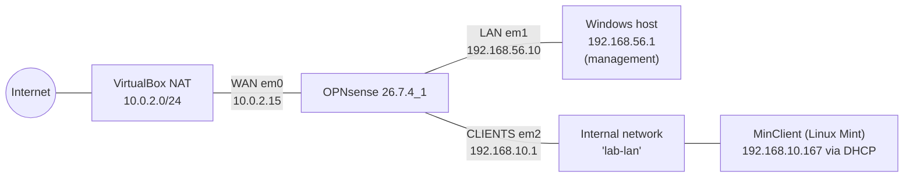

# Stage 3: Client Network with dnsmasq DHCP

**Lab:** Network configuration with OPNsense
**Stage:** 3 (a routed client network behind the firewall)
**Status:** ✅ Completed
**OPNsense version:** 26.7.4_1 (amd64)

---

## 1. Objective

Create a separate internal network behind OPNsense, connect a Linux client to it, and have the firewall provide everything the client needs: an IP address (dnsmasq DHCP), name resolution (Unbound DNS), a gateway, a firewall rule, and NAT to the internet.

The client network has no direct connection to the host laptop, so every working service on it proves the firewall is doing its job.

---

## 2. Topology

| Network | Interface | Subnet | Purpose |
|---|---|---|---|
| WAN | `em0` | `10.0.2.0/24` (DHCP) | Internet via VirtualBox NAT |
| LAN | `em1` | `192.168.56.0/24` | Management (host laptop, web GUI) |
| CLIENTS | `em2` | `192.168.10.0/24` | Client devices, served by dnsmasq |

---

## 3. Virtual Hardware

| VM | Change |
|---|---|
| OPNsense | Adapter 3 added: Internal Network, name `lab-lan` → appears as `em2` (MAC `08:00:27:d3:dd:36`) |
| MinClient | New VM: Linux Mint 22.3 Xfce ISO, Ubuntu 64-bit type, 2048 MB RAM, 25 GB disk, run as a live session (no installation) |
| MinClient | Adapter 1: Internal Network, name `lab-lan` (MAC `08:00:27:51:59:3c`) |

An Internal Network in VirtualBox behaves like a physical switch that only VMs are plugged into. Both VMs must use the exact same network name to be connected.

---

## 4. Configuration Steps

### 4.1 Interface assignment
*Interfaces → Assignments → +*: device `em2`, description `CLIENTS`, then Save and Apply.

### 4.2 Interface addressing
*Interfaces → [CLIENTS]*

| Setting | Value |
|---|---|
| Enable Interface | ✅ |
| IPv4 Configuration Type | Static IPv4 |
| IPv4 address | `192.168.10.1/24` |
| IPv6 | None |

`192.168.10.1` is the gateway for every device on this network.

### 4.3 dnsmasq general settings
*Services → Dnsmasq DNS & DHCP → General*

| Setting | Value | Reason |
|---|---|---|
| Enable | ✅ | |
| Interface | CLIENTS only | LAN already has VirtualBox's DHCP server; WAN is the outside |
| Listen port | `0` | Disables dnsmasq's DNS function; Unbound already serves DNS on port 53 |
| DHCP authoritative | ✅ | dnsmasq is the only DHCP server on this network |
| DHCP register firewall rules | ✅ | Automatically permits DHCP traffic on CLIENTS |

### 4.4 DHCP range
*Services → Dnsmasq DNS & DHCP → DHCP ranges → +*

| Setting | Value |
|---|---|
| Interface | CLIENTS |
| Start / End | `192.168.10.100` – `192.168.10.200` |
| Subnet mask | automatic (from interface, /24) |
| Lease time | 86400 s (1 day) |
| Description | Clients pool |

### 4.5 Firewall rule
A new interface starts with no pass rules, and OPNsense states this explicitly: all incoming connections on the interface are blocked until a pass rule exists.

*Firewall → Rules → CLIENTS → +*

| Setting | Value |
|---|---|
| Action | Pass |
| Interface (rule) | CLIENTS |
| Interface (origin) | empty (only valid for out-direction rules) |
| Direction | In |
| Version | IPv4 |
| Protocol | any |
| Source | any (see open item below) |
| Destination | any |
| Log | ✅ |
| State type | keep state |
| Description | Allow CLIENTS to any |

**Open item:** the source should be restricted from `any` to `CLIENTS network`, matching the LAN default rule. This limits the rule to genuine devices in `192.168.10.0/24` and rejects spoofed source addresses.

---

## 5. Verification (from MinClient)

| Test | Command | Result | What it proves |
|---|---|---|---|
| Address | `ip a` | `inet 192.168.10.167/24 ... dynamic`, lease ≈ 86400 s | dnsmasq DHCP works |
| Gateway | `ping -c 3 192.168.10.1` | 3/3 replies | Layer 2/3 link to the firewall |
| Internet by IP | `ping -c 3 8.8.8.8` | 3/3 replies, ~11 ms | Firewall rule and NAT work |
| Internet by name | `ping -c 3 google.com` | Resolved to `142.251.118.100`, 3/3 replies | DNS via Unbound works |

The replies showed `ttl=62`. Packets start with a TTL of 64 and each router decrements it by one, so 62 confirms the path crosses two routers: OPNsense and VirtualBox NAT.

The lease can also be seen from the firewall side under *Services → Dnsmasq DNS & DHCP → Leases*.

---

## 6. Troubleshooting Log

### Issue 1: em2 not available for assignment
**Symptom:** The assignment dialog listed only `em0` and `em1`.
**Cause:** Adapter 3 had not been saved in VirtualBox; adapters can only be added while the VM is fully powered off.
**Fix:** Powered off OPNsense (console option 5), added Adapter 3, verified it in the VM details panel, restarted.

### Issue 2: "Received-on is only valid for out direction rules"
**Symptom:** The rule could not be saved.
**Cause:** *Interface (origin)* had been set. It is a received-on filter used only with out-direction rules.
**Fix:** Cleared *Interface (origin)* and kept *Interface (rule)* = CLIENTS.

### Issue 3: Client received no DHCP lease
**Symptom:** `ip a` showed `enp0s3` UP but with no IPv4 address. `nmcli device connect enp0s3` returned "IP configuration could not be reserved (no available address, timeout)".

**Diagnosis:**

| Test | Result | Conclusion |
|---|---|---|
| Manual address `192.168.10.50/24`, then ping `192.168.10.1` | Destination Host Unreachable | No ARP reply from the firewall, so a link or interface problem, not DHCP |
| VirtualBox network settings on both VMs | Both on Internal Network `lab-lan` | Virtual cabling correct |
| CLIENTS interface settings rechecked and applied; ping repeated | 3/3 replies | Link to firewall working |
| Manual address flushed, DHCP requested again | Lease `192.168.10.167` | dnsmasq working |

**Resolution:** The link worked after the CLIENTS interface configuration was re-checked and applied. The exact trigger was not isolated; the most likely cause is that the interface address was not yet active when the client first booted, so its initial DHCP attempt timed out.

**Method note:** assigning a manual address separated "is the link working?" from "is DHCP working?". "Destination Host Unreachable" means the ARP question went unanswered, which rules out firewall rules, because an interface that owns an address answers ARP even when its rules block traffic.

---

## 7. How a Client Reaches the Internet (Traffic Flow)

1. **DHCP:** the client broadcasts a request; dnsmasq offers an address, subnet mask, gateway and DNS server (Discover, Offer, Request, Acknowledge).
2. **DNS:** the client asks the firewall for the address of a name; Unbound resolves and caches it.
3. **Routing decision:** the destination is outside `192.168.10.0/24`, so the packet goes to the gateway, whose MAC address is found via ARP.
4. **Filtering:** the CLIENTS rule is matched and the connection is recorded in the state table.
5. **NAT:** the private source address is replaced with the WAN address, since private ranges are not routable on the internet.
6. **Return:** the reply matches the state entry, is translated back, and is delivered to the client. Unsolicited inbound traffic has no state entry and is dropped.

### Troubleshooting ladder derived from this flow

| Check | Command | Failure points to |
|---|---|---|
| Has an address? | `ip a` / `ipconfig` | DHCP |
| Reaches the gateway? | `ping <gateway>` | Cabling, switch, ARP, interface |
| Reaches the internet by IP? | `ping 8.8.8.8` | Firewall rule or NAT |
| Reaches it by name? | `ping google.com` | DNS |

---

## 8. Real-World Context

### 8.1 Mapping the lab to a physical office

| Lab component | Physical equivalent |
|---|---|
| VirtualBox NAT (WAN) | Fiber line and ONU from the ISP (e.g. NTT, KDDI) |
| OPNsense VM | Small fanless appliance with several Ethernet ports running OPNsense |
| VirtualBox adapters | Physical ports on the appliance (`igc0`, `re0`, etc. on real hardware) |
| Internal Network `lab-lan` | A physical switch and structured cabling to desks |
| MinClient | An employee PC, printer, or Raspberry Pi |
| Host on LAN | The administrator's management network |

OPNsense itself is an operating system on a physical box, not a website. The web GUI is only its control panel, reached from a device on an inside network.

### 8.2 Manufacturing scenario: office vs. factory segmentation

Manufacturing companies typically separate the office network (IT) from the factory network (OT). Factory devices such as PLCs, CNC machines, cameras and sensors often run software that cannot be patched, must not reach the internet, and cause production downtime if they lose connectivity. The firewall sits between both networks with narrow rules.

| From → To | Policy | Reason |
|---|---|---|
| Office → Internet | Allow | Normal business use |
| Office → Factory | Only specific hosts and ports | e.g. production software reading machine data |
| Factory → Internet | Deny (or updates only) | Unpatched devices are easy targets |
| Factory → Office | Deny | A compromised machine cannot spread to office PCs |
| Internet → Inside | Deny | Default deny on WAN |

Changes in such environments usually need two people: one configuring the firewall, one on the factory floor confirming machines still work, ideally after testing on a separate test setup first. Multiple routers are common, either as a high-availability pair or one per building connected by VPN.

### 8.3 Role of dnsmasq

dnsmasq is a lightweight DHCP and DNS service. As DHCP server it leases addresses from a pool and supplies the gateway and DNS server; static mappings (*Hosts* tab) pin fixed addresses to printers, servers and machines by MAC address. As DNS server it can provide local names and cache lookups. In this lab it handles DHCP only, while Unbound handles DNS.

### 8.4 Role of a Raspberry Pi

A Raspberry Pi is a low-cost ARM computer running Linux (typically Raspberry Pi OS, Debian-based) from a microSD card or SSD. On a factory network it is commonly used for sensor data collection, reading machine data, floor dashboards, barcode stations, availability monitoring, or as a stand-in test device for network changes. In this lab, MinClient plays the same role: a small Linux device behind the firewall that obtains its address from dnsmasq and is managed with the same commands (`ip a`, `ping`, `nmcli`, SSH).

---

## 9. Next Step (Stage 4)

Build a small version of IT/OT segmentation: add a FACTORY network with a VM acting as a machine, allow the CLIENTS (office) network to reach it on one specific port only, block the factory network from the internet and the office, and verify each allow and block in the firewall live log. Also fix the open item from section 4.5.
