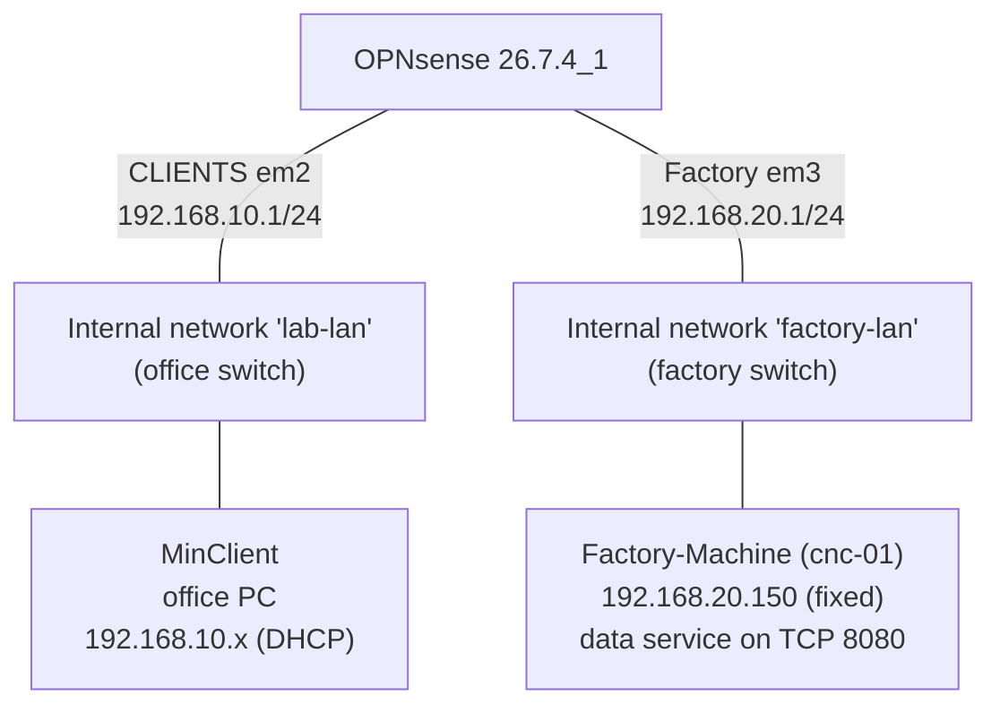

# Stage 4: Office / Factory Network Segmentation

**Lab:** Network configuration with OPNsense
**Stage:** 4 (separating an office network from a factory network)
**Status:** Completed
**OPNsense version:** 26.7.4_1 (amd64)

---

## 1. Objective

Build a small version of the IT/OT separation used in manufacturing companies. A new factory network is added behind the firewall, with a VM playing a factory machine. The goals:

| Goal | Result |
|---|---|
| Factory machine gets a permanent address from the firewall | Yes, `192.168.20.150` via a dnsmasq static mapping |
| Office PC can read the machine's data, on one port only | Yes, TCP 8080 allowed |
| Office PC cannot reach the machine in any other way | Yes, ping blocked |
| Factory machine cannot reach the internet | Yes, blocked by default deny |
| Factory machine cannot reach the office | Yes, blocked by default deny (no pass rules on Factory) |

---

## 2. Topology



The two internal networks have no direct connection. The only path between office and factory goes through OPNsense, so its rules decide what is allowed.

| Network | Interface | Subnet | Role |
|---|---|---|---|
| WAN | `em0` | `10.0.2.0/24` | Internet via VirtualBox NAT |
| LAN | `em1` | `192.168.56.0/24` | Management (host laptop, web GUI) |
| CLIENTS | `em2` | `192.168.10.0/24` | Office |
| Factory | `em3` | `192.168.20.0/24` | Factory machines |

---

## 3. Virtual Hardware

| VM | Change |
|---|---|
| OPNsense | Adapter 4 added: Internal Network `factory-lan` (appears as `em3`) |
| Factory-Machine | New VM: Linux Mint 22.3 Xfce live ISO, 2048 MB RAM, Adapter 1 on Internal Network `factory-lan`, MAC `08:00:27:49:36:02` |

In a real factory this is a cable from a free firewall port to the factory switch, and each machine cabled to that switch.

---

## 4. Configuration

### 4.1 Interface
*Interfaces > Assignments > +*: device `em3`, description `Factory`.
*Interfaces > [Factory]*: enabled, Static IPv4, `192.168.20.1/24`.

`192.168.20.x` was chosen so each network has its own number (10 = office, 20 = factory), which makes addresses easy to recognise in logs. `.1` is the gateway by convention.

### 4.2 dnsmasq
*Services > Dnsmasq DNS & DHCP > General*: Factory added next to CLIENTS under Interface.

*DHCP ranges*:

| Interface | Start | End | Description |
|---|---|---|---|
| CLIENTS | 192.168.10.100 | 192.168.10.200 | Clients pool |
| Factory | 192.168.20.100 | 192.168.20.200 | Factory pool |

*Hosts* (static mapping, so the machine always gets the same address):

| Host | IP | MAC | Description |
|---|---|---|---|
| cnc-01 | 192.168.20.150 | 08:00:27:49:36:02 | CNC machine line 1 |

The machine first received `.113` from the pool. After the mapping was saved, it was reconnected and received `.150`. For dnsmasq, OPNsense recommends placing reservations inside the pool.

```
sudo nmcli device disconnect enp0s3
sudo nmcli device connect enp0s3
```

### 4.3 Simulated machine data service
Real machines and PLCs share production data on a specific port. This was simulated on Factory-Machine with a small web server on TCP 8080:

```
python3 -m http.server 8080
```

### 4.4 Aliases
*Firewall > Aliases*

| Name | Type | Content | Description |
|---|---|---|---|
| CNC_01 | Host(s) | 192.168.20.150 | CNC machine line 1 |
| CNC_DATA_PORT | Port(s) | 8080 | Data port of factory machines |

The rule form did not accept a typed IP or a port outside its named list, so aliases were created. This is also the better practice: rules read as names instead of numbers, and if the machine's address or port changes, only the alias needs updating.

### 4.5 Firewall rules

**CLIENTS** (order matters, first match wins; ordered with sequence numbers 10, 20, 30):

| # | Action | Protocol | Source | Destination | Port | Log | Description |
|---|---|---|---|---|---|---|---|
| 1 | Pass | TCP | CLIENTS network | CNC_01 | CNC_DATA_PORT | Yes | Office to CNC data port |
| 2 | Block | any | CLIENTS network | Factory network | any | Yes | Block office to factory |
| 3 | Pass | any | CLIENTS network | any | any | No | Allow CLIENTS to any |

Rule 1 lets the office read the machine's data. Rule 2 blocks everything else towards the factory. Rule 3 keeps normal internet access for the office. If rule 3 were first, it would match all office traffic and rules 1 and 2 would never be used.

**Factory**: no pass rules. Everything the factory starts is blocked by default deny, except DHCP (automatic rule registered by dnsmasq). Replies to connections the office opened are still allowed, because the firewall is stateful.

---

## 5. Verification

### Before the rules (office rule was "any")

| From | Test | Result |
|---|---|---|
| MinClient | `ping -c 3 192.168.20.150` | 3/3 replies, `ttl=63` (one router in between) |

The office could reach the machine completely.

### After the rules

| From | Test | Expected | Result |
|---|---|---|---|
| MinClient | `curl http://192.168.20.150:8080` | Allowed | HTML directory listing returned from the machine |
| MinClient | `ping -c 3 192.168.20.150` | Blocked | 3 sent, 0 received, 100% loss |
| Factory-Machine | `ping -c 3 8.8.8.8` | Blocked | 3 sent, 0 received, 100% loss |

### Firewall log

*Firewall > Log Files > Live View* showed the factory machine blocked on the Factory interface by *Default deny*:

- ICMP from the machine to `8.8.8.8` (the internet test)
- Repeated UDP and TCP from the machine to `192.168.20.1` port 53. This is DNS: the machine was trying to look up names in the background and every attempt was blocked, because the Factory network has no pass rules at all.

### Still to capture

- A Live View entry labeled *Block office to factory* for the office ping (needs Auto-refresh or a filter on the CLIENTS interface)
- `ping -c 3 google.com` from MinClient, to document that office internet access still works
- A ping from Factory-Machine to MinClient's address, to document that factory to office is blocked

---

## 6. Troubleshooting Log

### Issue 1: Factory machine got no address
**Symptom:** `ip a` showed no IPv4 address on `enp0s3`. `nmcli device connect enp0s3` returned "IP configuration could not be reserved". `ping 8.8.8.8` returned "Network is unreachable".
**Diagnosis:** The dnsmasq log (*Services > Dnsmasq DNS & DHCP > Log File*) showed:
```
warning: interface em3 does not currently exist
```
**Cause:** Adapter 4 had not been saved in VirtualBox, so OPNsense had no `em3` network card, even though the interface was configured in the GUI.
**Fix:** Powered off OPNsense, added Adapter 4 again, confirmed it in the VM details, then started OPNsense first and the machine second. The machine then received an address.
**Method note:** the service's own log pointed directly at the problem, which is faster than guessing between DHCP settings, firewall rules and cabling.

### Issue 2: Wrong DHCP range
**Symptom:** The Factory range showed `192.168.20.100` to `192.168.10.200`.
**Cause:** Typo in the end address, which pointed into the office network.
**Fix:** Edited the range to end at `192.168.20.200`.

### Issue 3: Rule form would not accept an IP or port 8080
**Symptom:** Typing `192.168.20.150` as destination or `8080` as port gave "no matches".
**Fix:** Created the aliases `CNC_01` and `CNC_DATA_PORT` and selected them in the rule.

### Issue 4: New rules added below the allow-all rule
**Symptom:** The two new rules appeared under "Allow CLIENTS to any", where they would never match.
**Fix:** Set sequence numbers in advanced mode: 10, 20, 30.

---

## 7. Real-World Mapping

| Lab | Real factory |
|---|---|
| OPNsense Adapter 4 / `em3` | Firewall port cabled to the factory switch |
| Internal network `factory-lan` | Factory switch and cabling to each machine |
| Factory-Machine | A CNC machine, PLC or machine controller |
| MinClient | Production planning PC in the office |
| Port 8080 service | The machine's data interface |
| dnsmasq static mapping | Fixed address so office software always finds the machine |
| Aliases | Named groups like `FACTORY_MACHINES`, used across many rules |
| Rules 1 to 3 | The company's security policy between office and factory |

---

## 8. Key Concepts

**Segmentation.** Separate networks with the firewall as the only path between them. A compromised device in one network cannot freely reach the other.

**Default deny as a baseline.** The factory was isolated from the internet and the office before a single rule was written for it. Rules only add the specific exceptions that are needed.

**Least privilege.** The office gets exactly one port on one machine, not full access.

**Rule order.** Specific rules first, then blocks, then broad allows.

**Stateful filtering.** The machine can answer the office's request on port 8080 even though the Factory interface has no pass rules, because the reply matches a connection the office opened.

**Logs as evidence.** The live log shows which rule made each decision, which is how a rule change is proven to work.

---

## 9. Next Step (Stage 5)

DMZ and port forwarding: a server network whose web server is reachable from outside through a port-forward rule, while staying isolated from the office and factory.
