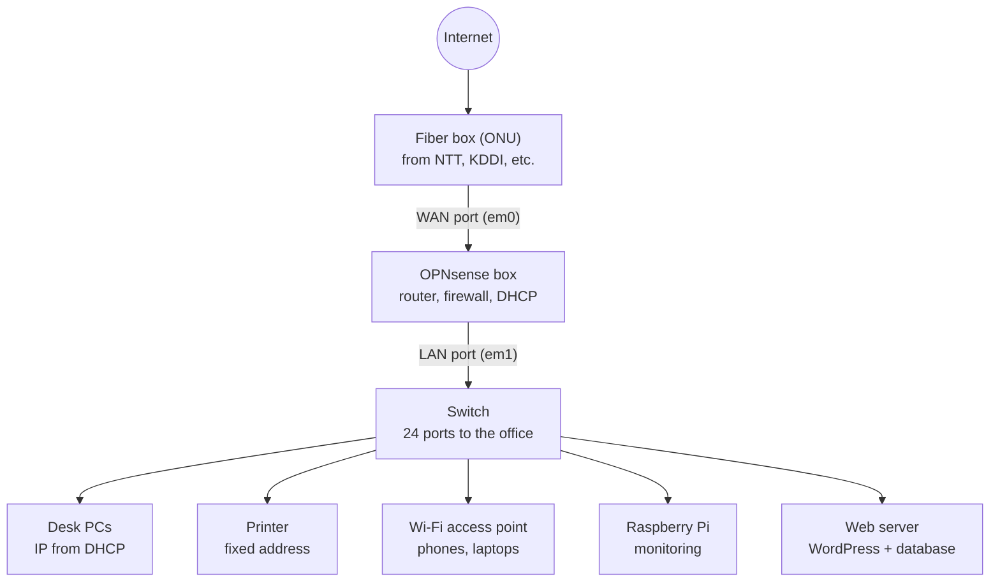
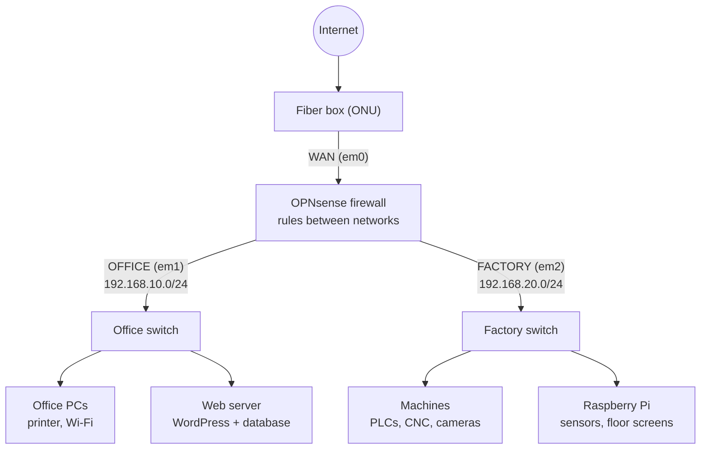

# Practical Examples: How This Lab Looks in Real Life

The labs in this repo run on one laptop with virtual machines. This page shows what the same setup looks like in a real company, with physical equipment and real cables. Two examples: a small office, and a manufacturing company with an office and a factory floor.

OPNsense is not a website. It's an operating system that runs on a small physical computer with several network ports. The web GUI is only its control panel, opened from a PC on the inside network, the same way a home router has a settings page at an address like 192.168.1.1.

## Example 1: Small Office

### How it's built

A company with around 20 people, one floor. In a small cabinet there's:

- The fiber box from the internet provider, where the internet enters the building
- A small, fanless computer running OPNsense. One cable goes from the fiber box into its WAN port.
- A switch. One cable goes from OPNsense's LAN port into it, and from the switch, cables run through the walls to every desk, the printer, the Wi-Fi access points, and the server.

Every arrow in the diagram is a real network cable. The switch doesn't make decisions; it just connects everything on the same network, like a power strip for network cables. Every device below it gets its address from dnsmasq on the OPNsense box, and all internet traffic passes through its firewall on the way out.

### A normal week for the IT person

- **New employee:** a new laptop is plugged in at a desk and gets an address automatically from dnsmasq. Nothing is configured by hand.
- **"The printer disappeared again":** its address keeps changing, so PCs can't find it. Fix: give it a fixed address in dnsmasq (static mapping by MAC address).
- **Visitor needs Wi-Fi:** guests go on a separate network with a rule that allows the internet but nothing internal.
- **Website is down:** check the server, its address, the database, and the firewall rule that lets outside visitors reach it.
- **Big change needed:** you can't experiment on the live network, because a mistake takes the whole office offline. So the change is tested on a separate test setup first.

### What happens when someone opens a website

1. **DHCP:** the PC asks for an address. dnsmasq gives it an IP, the subnet mask, the gateway (OPNsense), and the DNS server.
2. **DNS:** the PC asks OPNsense for the address of the website's name. Unbound looks it up and remembers it for next time.
3. **Routing:** the destination isn't on the local network, so the PC sends the packet to the gateway, finding it with ARP.
4. **Firewall:** OPNsense checks its rules for traffic coming from the LAN. It's allowed, and the connection is recorded in the state table.
5. **NAT:** OPNsense swaps the PC's private address for the company's public address and sends it out. This is how the whole office shares one internet line.
6. **Reply:** the website answers. OPNsense matches it to the state table, swaps the address back, and delivers it to the PC. Anything from outside that doesn't match a connection started from inside is dropped.

### Troubleshooting "the internet doesn't work"

Walk the steps in order. The first one that fails is where the problem is.

| Check | Command | If it fails |
|---|---|---|
| Does the PC have an address? | `ipconfig` / `ip a` | DHCP |
| Can it reach the gateway? | `ping <gateway>` | Cable, switch, ARP, interface |
| Can it reach the internet by IP? | `ping 8.8.8.8` | Firewall rule or NAT |
| Can it reach it by name? | `ping google.com` | DNS |

## Example 2: Manufacturing Company

### How it's built

Same start as the office: internet, fiber box, OPNsense. But here OPNsense uses three ports: WAN to the internet, one to the office switch, and one to the factory switch near the production floor. The office and the factory are two separate networks, and every packet between them has to pass through the firewall.

Office PCs usually get their addresses from dnsmasq. Factory machines usually get fixed addresses so they never change.

### Why the factory is separated

The office network (IT) is normal: PCs, email, printers, the website. The factory network (OT, operational technology) is different:

- Machines and controllers often run old software that can't be updated, so they're easy to attack if exposed
- Most of them should never reach the internet
- If they lose their connection, production stops, and every minute of downtime costs money

So the firewall sits between the two with strict rules:

| From | To | Policy | Reason |
|---|---|---|---|
| Office | Internet | Allow | Normal work |
| Office | Factory | Only specific hosts and ports | e.g. production software reading machine data |
| Factory | Internet | Deny, or updates only | Unpatched devices are easy targets |
| Factory | Office | Deny | A compromised machine can't spread to office PCs |
| Internet | Inside | Deny | Default deny on WAN |

### A normal week for factory IT

- **New CNC machine arrives:** it gets a fixed address on the factory network, and one rule lets the production planning PC in the office reach it on its one port. Nothing else.
- **A camera on the line stops showing video:** check whether it has its address, whether the firewall can ping it, and whether a rule is blocking it.
- **Temperature monitoring:** a Raspberry Pi collects sensor data and shows it on a screen on the floor. It goes on the factory network and is allowed only what it needs.
- **Rule change needed:** it can't be tested on the live factory, because if a machine loses its connection, the line stops. The change is tried on a test setup first.

### Why one IT person isn't enough

Factories often have two or three routers: a second OPNsense box as a backup that takes over if the first fails, or a router per building (main plant, warehouse) connected by VPN. Every change has two sides: someone at the firewall changing settings, and someone at the machines checking they still work. One person can't be in the server room and on the factory floor at the same time.

## The Tools in These Examples

**dnsmasq** is a small service on the firewall that hands out IP addresses (DHCP) and can also answer name lookups (DNS). Each address is a lease with a set time, and the device renews it before it runs out. Static mappings pin a fixed address to a device's MAC address, which is what printers, servers, and factory machines need. In OPNsense it's under Services > Dnsmasq DNS & DHCP, and the Leases page shows every device that got an address.

**A Raspberry Pi** is a credit-card-sized computer running Linux (usually Raspberry Pi OS, based on Debian) from a microSD card. It's cheap, small, and uses very little power. In factories it's used for collecting sensor and machine data, dashboards on floor screens, barcode stations, monitoring whether equipment is online, or as a stand-in device for testing network changes. It's usually run without a screen and managed over SSH, using the same Linux commands as any other Linux machine (`ip a`, `ping`, `apt`).

## How My Lab Maps to This

| Lab | Real company |
|---|---|
| VirtualBox NAT (WAN) | Fiber line and ONU from the ISP |
| OPNsense VM | Small physical appliance running OPNsense |
| VirtualBox network adapters | Physical ports on the appliance |
| Internal Network `lab-lan` | A physical switch and cabling |
| CLIENTS network (192.168.10.0/24) | The office network |
| Linux Mint VM | An office PC or a Raspberry Pi |
| My laptop on the LAN | The admin's management network |

The settings in Labs 01 to 03 (interfaces, dnsmasq, firewall rules, NAT) are the same screens used on real hardware. Only the cables are virtual. Lab 04 builds the factory side of Example 2.
